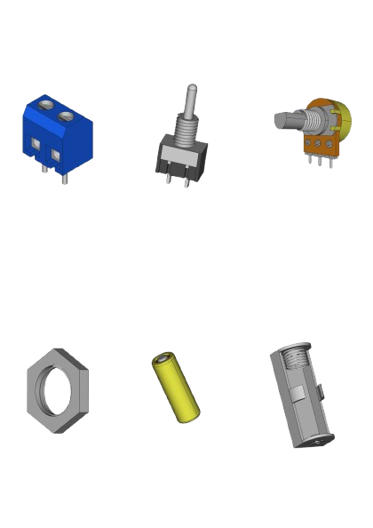

# 3D Electronic Component Designs for PCB Modeling
3D models of electronic components I created because they are not available in standard PCB libraries.  
Files are in **.FCStd** and can be converted to **.STEP** for PCB software.

## Components
- Potentiometer  
- Terminal Block  
- Switch  
- Battery  
- Battery Holder  
- Nut  

## Download
Download the models from the repository. For specific formats or more info, contact me.

---

# Diseños 3D de Componentes Electrónicos para PCB
Modelos 3D de componentes electrónicos creados personalmente, no disponibles en bibliotecas estándar.  
Archivos en **.FCStd**, convertibles a **.STEP** para software de diseño de PCB.

## Componentes
- Potenciómetro  
- Bornera  
- Interruptor  
- Batería  
- Portabatería  
- Tuerca  

## Descarga
Descargá los modelos desde el repositorio. Si necesitás un formato específico o más información, contactame.

